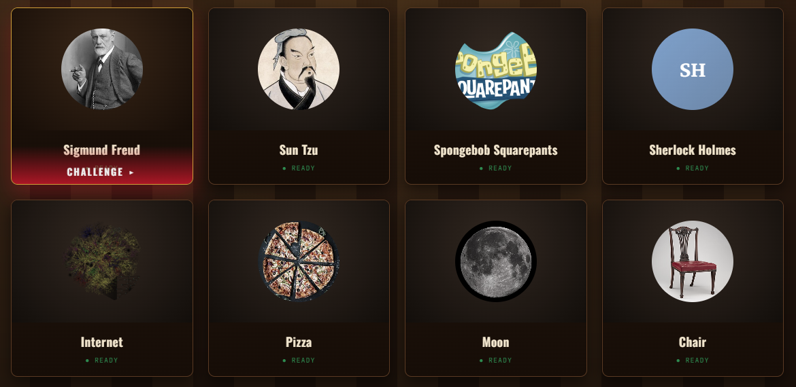

# The Courtroom ⚖️

**Argue your case against the machine.** A courtroom-style debate game where an
AI persona takes a controversial (and quietly fallacious) stance, and *you* — the
prosecutor — must dismantle it before time runs out. Built on RAG, an LLM jury,
and dynamically generated personas built from multiple online sources.

> Inspired by the drama of Ace Attorney: the persona is the **defendant**, you are
> the **prosecutor**, and an LLM is the **judge** who decides whether your
> objection holds.

---



Anyone with a Wikipedia page is fair game — and we mean *anyone*.
**Sigmund Freud** will tell you your argument proves you have mommy issues.
**Sun Tzu** will have already won before you finish your opening sentence.
**SpongeBob SquarePants** will passionately defend the economic superiority of Bikini Bottom.
**Sherlock Holmes** will deduce that your refutation is logically unsound before you hit Enter.
**The Internet** will claim credit for inventing everything, including itself.
**Pizza** will die on the hill that pineapple is a war crime against humanity.
**The Moon** is genuinely tired of being visited uninvited since 1969.
**A Chair** has strong opinions about posture, and they are non-negotiable.

---

## 🎯 The core loop

1. **Summon a defendant** — type a name, and a persona is built from multiple
   sources (clean Wikipedia article + Wikidata structured facts + DBpedia summary
   + real Wikiquote quotations → embeddings in Qdrant).
2. **Open the trial** — the persona answers a personality quiz, then states a
   hot take rooted in a hidden logical fallacy.
3. **Argue** — you present arguments; the persona defends its position using
   **RAG (its own knowledge)** + **its personality traits**.
4. **OBJECTION!** — once you've made enough arguments, slam the objection button.
   An LLM jury rules **CASE WON** or **NOT PROVEN**, and reveals the fallacy plus
   a model refutation.

---

## 🏗️ Architecture

```
┌─────────────────────────────────────────────────────────────┐
│                  Frontend (React 19 + Vite)                  │
│   Courtroom UI · TypeScript · Tailwind · health-gated grid  │
└──────────────────────────┬──────────────────────────────────┘
                           │ HTTP/JSON (:8001)
┌──────────────────────────▼──────────────────────────────────┐
│                  Backend (FastAPI + SQLModel)                │
│  /create_persona        → async multi-source ingest pipeline │
│  /ace-attorney/start    → personality quiz + fallacy gen     │
│  /ace-attorney/argue    → RAG + traits → persona rebuttal    │
│  /ace-attorney/objection→ LLM jury verdict                   │
└──────────────┬────────────────┬────────────────┬────────────┘
               │                │                │
        ┌──────▼──────┐  ┌──────▼─────┐  ┌───────▼──────┐
        │   Qdrant    │  │   Redis    │  │    Celery    │
        │ (vectors)   │  │  (broker)  │  │  (workers)   │
        └──────┬──────┘  └────────────┘  └───────┬──────┘
               │                                  │
        ┌──────▼──────────────────────────────────▼─────┐
        │     Ollama (on the host — your machine)        │
        │  ├─ mistral              (debate + jury reasoning) │
        │  └─ nomic-embed-text (768-dim embeddings)     │
        └───────────────────────────────────────────────┘
```

---

## ✅ Prerequisites

- **Docker** + Docker Compose
- **[Ollama](https://ollama.com)** — install from **https://ollama.com/download**

You must have the **Ollama server running** before starting the stack. Either
launch the **desktop app**, or from a terminal run:

```bash
ollama serve
```

That's it — you do **not** need to pull any models manually. On first boot the
backend pulls `mistral` and `nomic-embed-text` into your Ollama automatically.

---

## 🚀 Quick start

```bash
# 1. start Ollama (leave it running):
ollama serve            # or just open the Ollama desktop app

# 2. then bring up the stack:
docker compose up -d

# Frontend → http://localhost:5176
# API      → http://localhost:8001  (Swagger at /docs)
# Qdrant   → http://localhost:6333
```

On first boot the backend pulls `mistral` (~4 GB) and `nomic-embed-text` into your
host Ollama **automatically, in the background**. The frontend polls `/health`
and keeps defendants locked (dimmed) until the models finish downloading — watch
progress with:

```bash
docker compose logs -f api
```

Models are cached by Ollama on your machine, so subsequent runs are instant.
Containers reach Ollama at `host.docker.internal:11434` by default — override
with `OLLAMA_HOST` in a `.env` if yours runs elsewhere.

---

## 🤖 Where the RAG actually lives

**Ingestion (building a persona)** — `backend/worker/tasks.py` + `backend/pipeline.py` + `backend/utils.py`
1. Each source is gathered and tagged with its own `source_type`:
   - `wikipedia_resolver` → clean plain-text article (MediaWiki `explaintext`)
   - `wikidata_resolver` → structured facts (occupation, citizenship, education,
     awards, …) rendered to readable text
   - `dbpedia_resolver` → the English DBpedia abstract (falls back to the
     shorter DBpedia description when the public endpoint omits the abstract)
   - `wikiquote_resolver` → real quotations in the person's own voice
2. `chunk_text` segments everything (3000-char chunks); `nomic-embed-text`
   embeds each chunk
3. chunks land in **one** Qdrant collection, each point tagged with `persona_id`
   and `source_type`

   Retrieval filters only by `persona_id`, so a single search returns the best
   matches across **all** sources at once. Every source is resilient — a flaky
   endpoint is skipped, never breaking the persona build.

**Generation (persona's rebuttal)** — `backend/agents/debate_agent.py` + `utils.py`
1. `get_persona_embeddings` queries Qdrant using the persona's dominant **traits**
   + the fallacy theme
2. `build_persona_response_prompt` fuses retrieved context + traits + your argument
3. `mistral` generates an in-character defense

The personality system (a 14-question quiz → trait scores `0.0–1.0`) is what
makes each persona argue differently — that difference is now aimed **at you**.

---

## 🔌 API endpoints

```
POST  /create_persona?persona_name=X     # kick off async build (Celery)
GET   /load_personas                     # list personas (+ loaded flag)
GET   /task/{task_id}                     # build task status
GET   /health                            # readiness probe

POST  /ace-attorney/start                # quiz + fallacy + new debate
POST  /ace-attorney/argue                # your argument → persona rebuttal
POST  /ace-attorney/objection            # jury verdict on your objection

GET   /debates/{debate_id}/details       # full transcript + result
```

---

## 📁 Project structure

```
the-courtroom/
├── backend/
│   ├── agents/
│   │   ├── persona_fallacy_generator.py   # persona's hot take (fallacy)
│   │   ├── debate_agent.py                # personality quiz + RAG rebuttal
│   │   └── objection_evaluator.py         # LLM jury verdict
│   ├── database/
│   │   ├── models.py                      # Persona, Debate (SQLModel)
│   │   └── session.py                     # async session factory
│   ├── services/
│   │   ├── persona_service.py             # persona CRUD
│   │   └── debate_service.py              # debate + traits persistence
│   ├── worker/
│   │   ├── tasks.py                       # Celery persona build pipeline
│   │   └── celery.py                      # Celery app
│   ├── pipeline.py                        # Wikipedia + Wikidata + DBpedia + Wikiquote
│   ├── utils.py                           # embeddings, Qdrant, RAG helpers
│   └── main.py                            # FastAPI app + endpoints
│
├── frontend/
│   └── src/
│       ├── pages/
│       │   ├── HomePage.tsx               # courtroom grid + summon modal
│       │   └── AceAttorneyArena.tsx       # VS intro → trial → verdict
│       ├── components/
│       │   ├── PersonaCard.tsx            # "case file" card
│       │   └── PersonaAvatar.tsx          # portrait / initials
│       ├── api/client.ts                  # typed API client
│       └── types/index.ts                 # shared interfaces
│
├── docker-compose.yml                     # project name: the-courtroom
├── design-mock.html                       # standalone design preview
├── LICENSE                                # CC BY-NC 4.0
└── README.md
```

---

## 🛠️ Tech stack

| Layer            | Tech                                          |
|------------------|-----------------------------------------------|
| Frontend         | React 19, TypeScript, Vite, Tailwind CSS      |
| Backend          | FastAPI, SQLModel, async Python               |
| Vector DB        | Qdrant (cosine, 768-dim)                       |
| Cache / Queue    | Redis + Celery                                 |
| LLM              | Ollama (host) — `mistral` + `nomic-embed-text`    |
| Containerization | Docker Compose                                 |

---

## 📝 License

**Creative Commons Attribution-NonCommercial 4.0 International (CC BY-NC 4.0).**

You may look at, study, share, and build upon this project — but **not for
commercial purposes** without explicit written permission. See [LICENSE](LICENSE)
for the full terms. Third-party dependencies retain their own licenses.

---

⚖️ *The defendant has stated their case. The floor is yours, counselor.*
